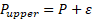
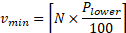
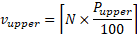
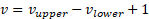

# 13204번 표본의 수 구하기

## 링크

[13204번: 표본의 수 구하기 (acmicpc.net)](https://www.acmicpc.net/problem/13204)

## 제약 조건

| 제약 조건명 |   값    |
| :---------: | :-----: |
|  시간 제한  |   1초   |
| 메모리 제한 |  256MB  |
|  정답 비율  | 20.177% |

## 접근

주어진 찬성 비율을 이용해서, 가능한 '예' 투표 수의 범위를 구할 수 있다. 즉, 다음의 부등식을 만족하는 투표 수가 존재하는 최소값을 찾는 것이라고 할 수 있다. 구하고자 하는 값은 N, 최소 샘플의 크기이다.

 (1)

이 때, 와 의 값은 다음과 같다.

 

여기서 은 충분히 작은 임의의 수이다.

가능한 투표 수 는 다음과 같이 계산된다.

N을 증가시켜가면서 조건을 만족하는 최소 N 값을 출력하면 된다.
