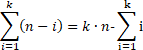
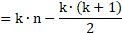
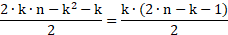

# 15118번 Halfway

## 링크

[1003번: 피보나치 함수 (acmicpc.net)](https://www.acmicpc.net/problem/1003)

## 제약 조건

|  제약 조건명  |   값    |
| :-----------: | :-----: |
|   시간 제한   |   1초   |
| 메모리 제한한 |  512MB  |
|   정답 비율   | 30.172% |

## 접근

평범한 이진탐색법을 사용해서 풀면 된다. 그러나 주어진 수 전체를 리스트로 만들거나 주어진 인덱스에 해당하는 합산 값을 리스트로 만드는 것은 피해야 한다. 만약 최대 길이의 정수값들이 입력되면, 메모리만 16GB가량이 필요하다. 따라서 배열이나 리스트의 값들을 비교하는 방식이 아니라, 인덱스 값을 바탕으로 즉석에서 해당 인덱스에 해당하는 값을 계산해내는 방법을 사용해야 한다.

각 인덱스에 해당하는 값을 계산하는 공식은 다음과 같다. 

그리고 한 가지 더 주의해야 할 점은, 우리가 목표하는 중간값과 정확하게 일치하는 index가 없을수도 있다는 것이다. 이런 경우에는, mid에서 왼쪽에 있는 값을 반환해야 하므로, 이진 탐색에서 반환하는 값은 left가 되어야 한다.