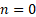

# 15710번 xor 게임

## 링크

[15710번: xor 게임 (acmicpc.net)](https://www.acmicpc.net/problem/15710)

## 제약 조건

| 제약 조건명 |   값    |
| :---------: | :-----: |
|  시간 제한  |  0.5초  |
| 메모리 제한 |  128MB  |
|  정답 비율  | 45.032% |

## 접근

[백준 15710번: xor 게임 (tistory.com)](https://memoacmicpc.tistory.com/entry/백준-15710번-xor-게임) 의 내용을 참고하면, 일반적으로 모든 a, b에 대해 a xor x = b의 근 x는 항상 존재하고, 이 근은 유일하다. 즉, N번만큼 카드를 뽑을 때, 마지막 N-1번째에는 반드시 xor했을 때 결괏값이 b가 나오는 값이 존재하므로, 그 이 전의 결괏값들은 임의의 어떤 값이 들어오더라도 상관없다. 따라서, 경우의 수는 N - 1번까지는 매 회마다 2 ^ 31까지이고, N번째에는 반드시 결정된 하나의 카드가 뽑히므로 1이다. 따라서 경우의 수를 구하는 것은 (2 ^ 31) ^ (N - 1)을 수행하면 된다. 문제점은, 이렇게 큰 수를 연산하는 데에는 시간이 상당히 오래 걸릴 수 있다는 것이다. 이를 해결하기 위해서 분할 정복을 이용한 거듭제곱을 수행할 수 있다.

분할정복을 이용한 거듭제곱 (Exponential by Squaring)은 지수를 절반으로 줄여서 계산량을 줄이는 방법이다. 이 방법의 시간 복잡도는 O(log n)이다. 이는 기존의 N번 곱해서 구하는 방법의 시간 복잡도 O(n)보다 빠르다. 분할정복을 이용한 거듭제곱은 다음과 같은 논리에 기반한다.

1. 이면  (기저 사례)
2. 이 짝수이면, 
3. 이 홀수이면, 

이 방법은 을 절반으로 줄여가며 계산하기 떄문에 매우 효율적이다.
