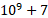

# 29809번 주식을 안전하게 (Easy)

## 링크

[29809번: 주식을 안전하게 (Easy) (acmicpc.net)](https://www.acmicpc.net/problem/29809)

## 제약 조건

| 제약 조건명 |   값    |
| :---------: | :-----: |
|  시간 제한  |   1초   |
| 메모리 제한 | 1024MB  |
|  정답 비율  | 18.367% |

## 접근

주어진 점화식은 주기성을 가지고 있는 함수이다. 초기값으로부터 한 주기 내부의 값들에 대해서 계산한 다음에, 구하고자 하는 주기내 인덱스(k)를 주기 내부로 끌어와서 위치시키고, 몇 주기 뒤의 값인지를 확인한 다음에 보정 상수를 지나간 주기만큼 제곱한 다음에 첫번쨰 주기의 해당 인덱스 값에 곱해서 스케일링하고, 그 값을 으로 나누어주면 된다.

